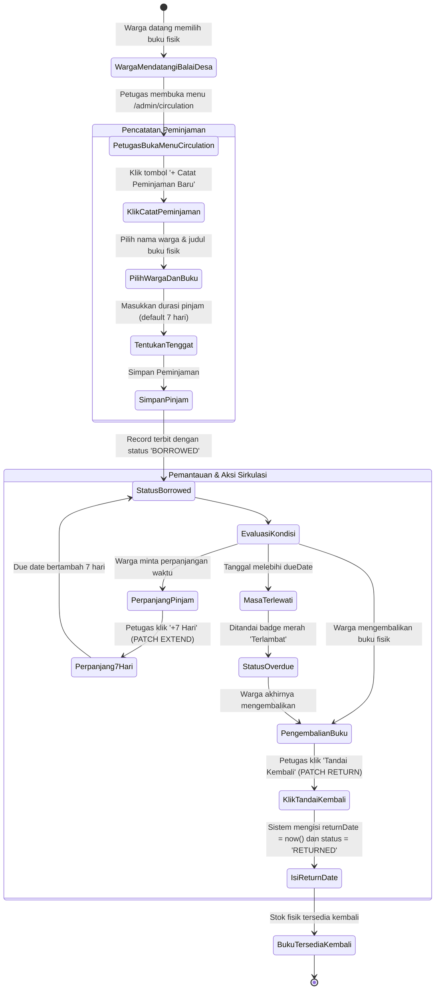
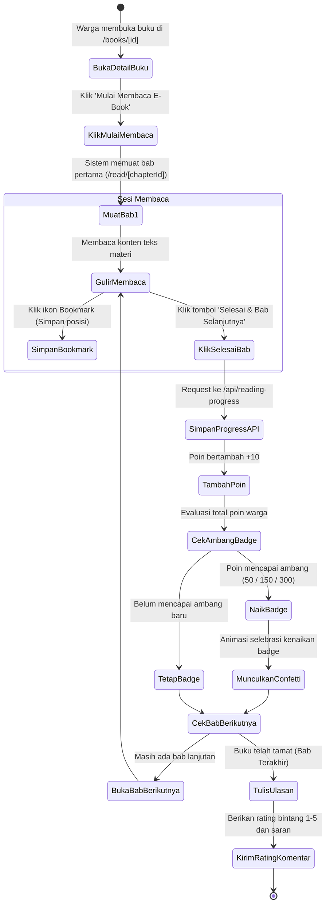
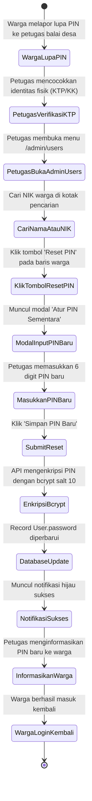

# ⚡ Activity Diagram — As-Built System

Dokumen ini memodelkan aktivitas langkah-demi-langkah (*activity flow*) pada 3 proses operasional paling kritikal dalam Sistem Informasi Perpustakaan Digital Desa Pangkalan.

---

## 1. Aktivitas Sirkulasi Peminjaman & Pengembalian Buku Balai Desa

Proses pelayanan peminjaman buku fisik di Balai Desa Pangkalan:

---

## 2. Aktivitas Membaca & Gamifikasi Literasi Warga

Alur membaca per bab dan akumulasi poin membaca:

---

## 3. Aktivitas Reset PIN Akun Warga oleh Administrator

Alur penanganan warga yang lupa PIN 6 digit:

