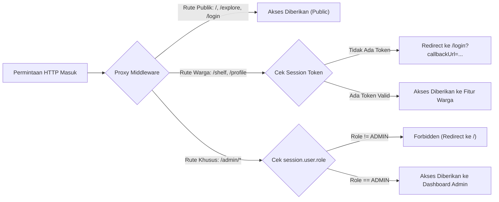

# 🏛️ System Architecture Diagram — Pustaka Pangkalan

Dokumen ini memetakan arsitektur teknis terimplementasi (*as-built architecture*) dari aplikasi web Sistem Informasi Perpustakaan Digital Desa Pangkalan.

---

## 1. Arsitektur Komponen Tingkat Tinggi (High-Level Architecture)

Aplikasi dibangun menggunakan model **Serverless Jamstack / Fullstack Modern** berbasis Next.js App Router dan database serverless PostgreSQL:

```mermaid
graph TB
    subgraph Client_Tier["Client Tier (Gawai Warga & Komputer Balai Desa)"]
        BrowserMobile["Mobile Browser (Chrome / Safari / PWA)"]
        BrowserDesktop["Desktop Browser (Komputer Admin Balai Desa)"]
    end

    subgraph CDN_Edge["Edge / CDN Infrastructure (Vercel Network)"]
        VercelEdge["Vercel Edge Network (https://perpus-pangkalan.vercel.app)"]
        EdgeCache["Static Assets & Image Optimization (/public, /icons, /logo)"]
        ProxyMiddleware["Proxy / Route Middleware (Session & Role RBAC Guard)"]
    end

    subgraph Application_Tier["Application Tier (Next.js 16 App Router Serverless Engine)"]
        subgraph Presentation_Layer["UI Presentation Layer (React 19 Server & Client Components)"]
            PublicPages["Halaman Publik (Home, Explore, Book Detail, Shelf, Profile)"]
            AdminPages["Halaman Admin (/admin, books, circulation, dusuns, categories)"]
            StateContext["React State (SWR Client Caching, LanguageContext ID/SU)"]
        end

        subgraph Service_API_Layer["Route Handlers & Business Logic Layer (/api/*)"]
            AuthModule["NextAuth.js (Credentials Provider + Bcrypt PIN)"]
            BooksAPI["Katalog & Bab (/api/books, /api/read)"]
            CirculationAPI["Sirkulasi Peminjaman Balai Desa (/api/admin/circulation)"]
            GamificationAPI["Pelacakan Baca & Leaderboard (/api/reading-progress)"]
            MasterDataAPI["Kategori & Dusun (/api/categories, /api/dusuns)"]
            KadesAIModule["Layanan Asisten Cerdas Kades AI (/api/ai/chat)"]
        end

        subgraph Data_Access_Layer["Data Access Layer (Prisma ORM 7.9)"]
            PrismaClient["Prisma Client with Neon WebSocket Adapter"]
            ValidationZod["Runtime Input Validation (Zod Schemas)"]
            ConnectionRetry["Connection Resilience Layer (Exponential Backoff)"]
        end
    end

    subgraph Database_Tier["Database Tier (Neon Serverless PostgreSQL)"]
        PostgresDB[("PostgreSQL Database (Neon Cloud Cluster)")]
        Tables[("10 Relational Tables: User, Dusun, Category, Book, Chapter, Bookmark, ReadingProgress, Review, BorrowRecord, Announcement")]
    end

    %% Connectors
    BrowserMobile -->|HTTPS Request| VercelEdge
    BrowserDesktop -->|HTTPS Request| VercelEdge
    VercelEdge --> EdgeCache
    VercelEdge --> ProxyMiddleware
    ProxyMiddleware --> Presentation_Layer
    Presentation_Layer --> Service_API_Layer
    Service_API_Layer --> ValidationZod
    ValidationZod --> PrismaClient
    PrismaClient --> ConnectionRetry
    ConnectionRetry -->|Secure TLS WebSocket / Pooling| PostgresDB
    PostgresDB --- Tables
```

---

## 2. Lapisan Keamanan & Autentikasi (Security & RBAC Architecture)

---

## 3. Topologi Lingkungan Produksi (Deployment Topology)

| Komponen | Penyedia / Lingkungan | Keterangan As-Built |
|---|---|---|
| **Web Server & Hosting** | Vercel Serverless Platform | Deployment otomatis terhubung ke branch `main` GitHub |
| **Domain Resmi** | Vercel Edge Domain | `https://perpus-pangkalan.vercel.app` |
| **Database Server** | Neon Serverless PostgreSQL | PostgreSQL versi 16+ dengan auto-scaling compute |
| **Konektor DB** | `@neondatabase/serverless` + `@prisma/adapter-neon` | Menggunakan koneksi WebSocket/HTTP pool tahan latency |
| **Storage Aset Statis** | Next.js Static Optimization | Berkas ikon, logo resmi Sukabumi, dan mockup tersimpan di `/public` |
