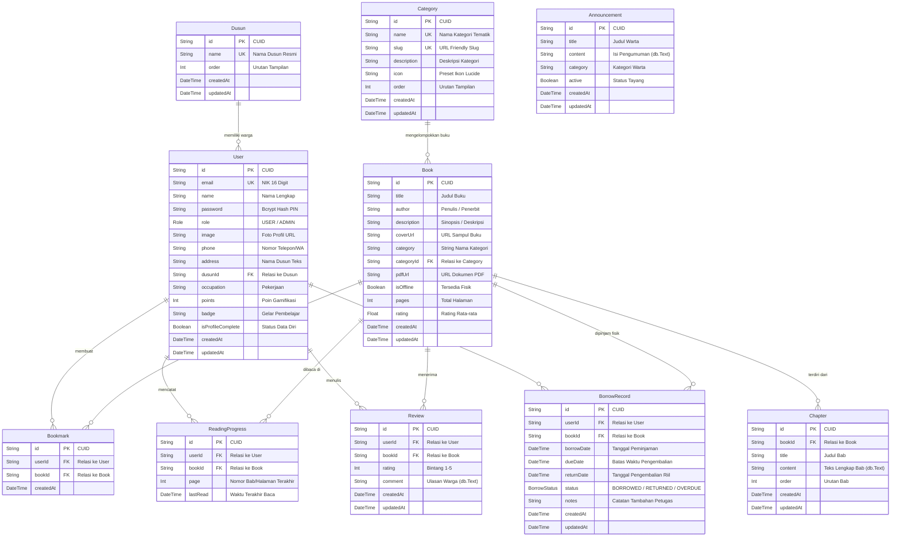

# 🗄️ Entity Relationship Diagram (ERD) — As-Built System

Diagram ini menggambarkan struktur relasional database aktual yang didefinisikan dalam [prisma/schema.prisma](file:///d:/CODEX-PROJECT/Perpustakaan%20Digital/prisma/schema.prisma) dan di-deploy pada klaster PostgreSQL Neon Serverless.

---

## 1. Diagram Relasi Entitas (Mermaid ERD)

---

## 2. Definisi Tipe Enum Database

### `Role`
- `USER`: Pengguna reguler (warga desa dan pembaca umum).
- `ADMIN`: Petugas administrasi dan pengelola perpustakaan balai desa.

### `BorrowStatus`
- `BORROWED`: Buku sedang dipinjam secara fisik oleh warga dari balai desa.
- `RETURNED`: Buku telah dikembalikan ke balai desa dan disetujui petugas.
- `OVERDUE`: Masa peminjaman telah melewati tanggal `dueDate` dan belum dikembalikan.

---

## 3. Batasan Unik & Integritas Relasional (Constraints)

1. `Bookmark`: Memiliki constraint unik gabungan `@@unique([userId, bookId])` — seorang warga hanya memiliki 1 penanda aktif per buku.
2. `ReadingProgress`: Memiliki constraint unik gabungan `@@unique([userId, bookId])` — kemajuan membaca diperbarui per record buku.
3. `Review`: Memiliki constraint unik gabungan `@@unique([userId, bookId])` — seorang warga hanya dapat memberikan 1 ulasan resmi per judul buku.
4. `Dusun.name`: Unik (`@unique`) untuk mencegah duplikasi nama wilayah dusun.
5. `Category.name` & `Category.slug`: Unik (`@unique`) untuk keandalan routing dan pengkategorian.
6. **Cascade Action**:
   - Penghapusan `Book` akan menghapus seluruh `Chapter`, `Bookmark`, `ReadingProgress`, `Review`, dan `BorrowRecord` terkait (`onDelete: Cascade`).
   - Penghapusan `Dusun` atau `Category` bersifat aman (`onDelete: SetNull`), sehingga tidak menghapus data warga maupun koleksi buku yang sudah ada.
