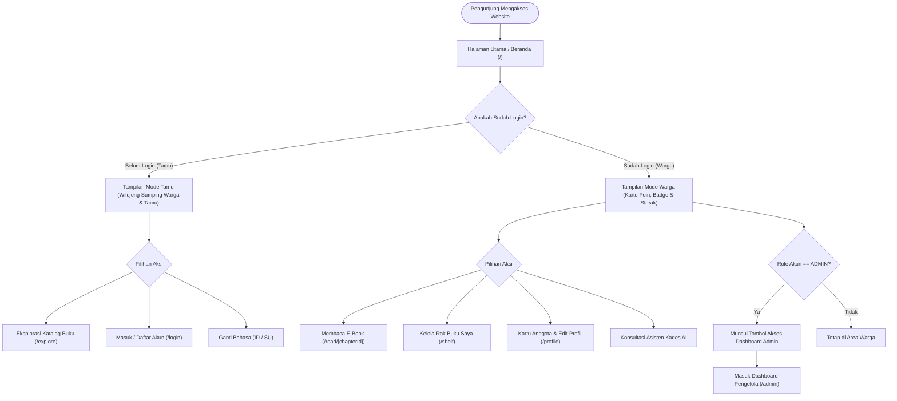
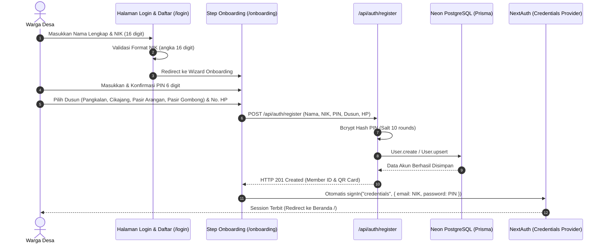
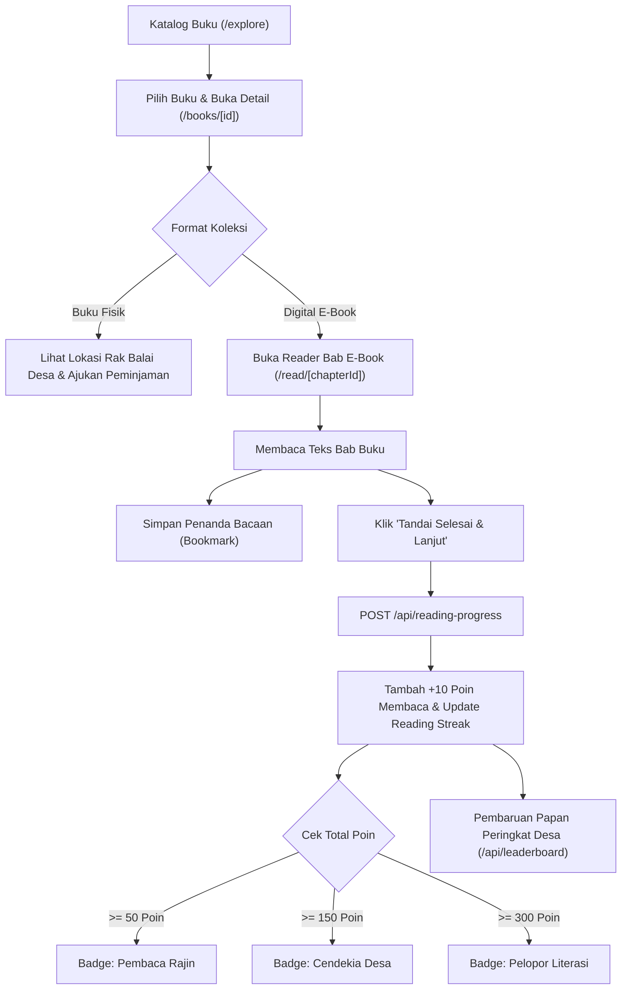
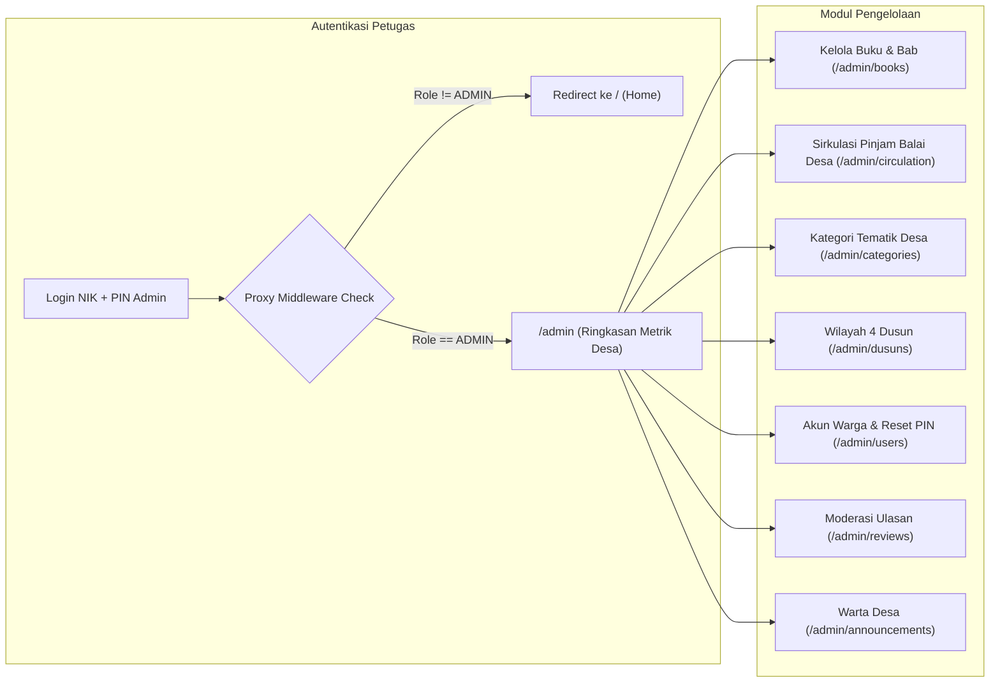

# 🔄 System Flow Diagram — Pustaka Pangkalan

Dokumen ini memetakan alur sistem aktual (*as-built system flow*) dari Sistem Informasi Perpustakaan Digital Desa Pangkalan, Kec. Cikidang, Kabupaten Sukabumi.

---

## 1. Alur Sistem Umum (General System Flow)

Alur penelusuran umum bagi setiap pengunjung website:

---

## 2. Alur Autentikasi Warga (Citizen Auth & Onboarding Flow)

Alur pendaftaran berbasis NIK dan pembuatan PIN 6 digit:

---

## 3. Alur Membaca & Gamifikasi Literasi (Reading & Gamification Flow)

---

## 4. Alur Manajemen Pengelola Balai Desa (Administrative Flow)

Alur kerja petugas/administrator di `/admin`:

