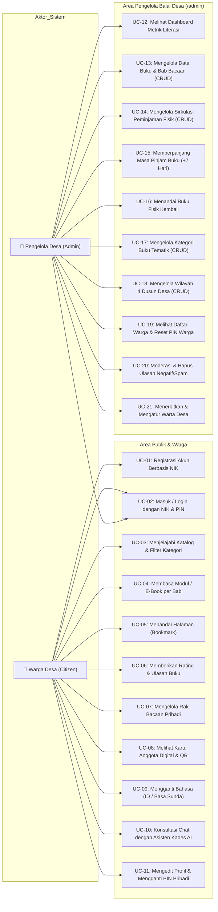

# 🎯 Use Case Diagram — As-Built System

Diagram ini memetakan use case aktual yang disediakan oleh Sistem Informasi Perpustakaan Digital Desa Pangkalan berdasarkan implementasi antarmuka dan hak akses pengguna.

---

## 1. Diagram Use Case Utama

---

## 2. Rincian Aktor & Kewenangan

| Aktor | Deskripsi Peran | Batasan Akses |
|---|---|---|
| **Warga Desa (Citizen)** | Masyarakat umum dan warga dari 4 dusun (Pangkalan, Cikajang, Pasir Arangan, Pasir Gombong) | Mengakses modul membaca, menyimpan buku ke rak, memberikan ulasan, melihat leaderboard poin, serta berkonsultasi via Kades AI. Tidak dapat membuka rute `/admin`. |
| **Pengelola Desa (Admin)** | Perangkat/petugas balai desa yang bertugas mencatat sirkulasi dan memelihara konten | Memiliki seluruh hak akses warga ditambah akses penuh ke dashboard operasional `/admin/*`, manajemen master data buku, sirkulasi, dusun, kategori, dan reset PIN warga. |
| **Pengunjung Tamu (Guest)** | Pengguna yang belum login / baru mengunjungi web | Dapat melihat beranda, menjelajah katalog buku, dan membaca warta desa. Diarahkan masuk/mendaftar saat ingin membuka rak buku atau modul interaktif. |
