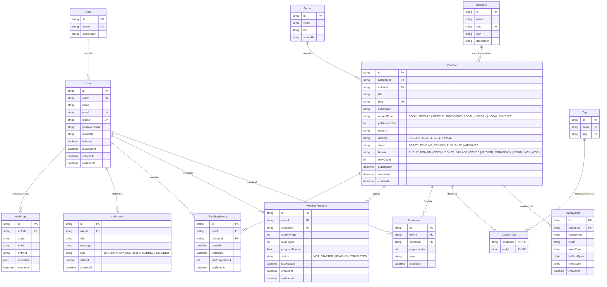

# Entity Relationship Diagram (ERD) & Database Schema

Dokumen ini berisi rancangan basis data **PostgreSQL**, **Mermaid ERD**, **Kamus Data (Data Dictionary)**, dan **Prisma Schema (`schema.prisma`)** untuk **Perpustakaan Digital Desa**.

---

## 1. Visual Entity Relationship Diagram (Mermaid ERD)



---

## 2. Kamus Data (Data Dictionary)

### 2.1 Tabel `User`
Tabel penyimpan data akun warga dan pengelola.

| Nama Kolom | Tipe Data | Constraint | Keterangan |
| :--- | :--- | :--- | :--- |
| `id` | VARCHAR(36) / UUID | Primary Key | Identifier unik user |
| `roleId` | VARCHAR(36) | Foreign Key -> `Role.id` | Peran hak akses user |
| `name` | VARCHAR(100) | NOT NULL | Nama lengkap |
| `email` | VARCHAR(100) | UNIQUE, NULLABLE | Alamat email opsional |
| `phone` | VARCHAR(20) | UNIQUE, NOT NULL | Nomor WhatsApp / Telepon aktif |
| `passwordHash` | VARCHAR(255) | NOT NULL | Hash kata sandi (Bcrypt/Argon2) |
| `avatarUrl` | TEXT | NULLABLE | URL foto profil di Object Storage |
| `isActive` | BOOLEAN | DEFAULT true | Status keaktifan akun |
| `lastLoginAt` | TIMESTAMP | NULLABLE | Waktu terakhir login |
| `createdAt` | TIMESTAMP | DEFAULT NOW() | Tanggal pembuatan |
| `updatedAt` | TIMESTAMP | DEFAULT NOW() | Tanggal perubahan terakhir |

---

### 2.2 Tabel `Content`
Tabel utama penyimpan metadata koleksi buku, modul, dokumen, dan sejarah desa.

| Nama Kolom | Tipe Data | Constraint | Keterangan |
| :--- | :--- | :--- | :--- |
| `id` | VARCHAR(36) | Primary Key | Identifier unik konten |
| `categoryId` | VARCHAR(36) | Foreign Key -> `Category.id` | Kategori utama |
| `authorId` | VARCHAR(36) | Foreign Key -> `Author.id`, NULL | Penulis / Penyusun |
| `title` | VARCHAR(200) | NOT NULL | Judul koleksi/buku |
| `slug` | VARCHAR(220) | UNIQUE, NOT NULL | SEO Friendly URL Slug |
| `description` | TEXT | NULLABLE | Ringkasan/Sinopsis |
| `contentType` | ENUM | NOT NULL | `BOOK`, `MODULE`, `ARTICLE`, `DOCUMENT`, `LOCAL_HISTORY`, `LOCAL_CULTURE` |
| `publicationYear`| INT | NULLABLE | Tahun terbit |
| `coverUrl` | TEXT | NULLABLE | URL thumbnail cover (300x450 px) |
| `visibility` | ENUM | DEFAULT 'REGISTERED' | `PUBLIC`, `REGISTERED`, `PRIVATE` |
| `status` | ENUM | DEFAULT 'DRAFT' | `DRAFT`, `PENDING_REVIEW`, `PUBLISHED`, `ARCHIVED` |
| `license` | ENUM | DEFAULT 'VILLAGE_OWNED'| `PUBLIC_DOMAIN`, `OPEN_LICENSE`, `VILLAGE_OWNED`, `AUTHOR_PERMISSION`, `COMMUNITY_WORK` |
| `viewCount` | INT | DEFAULT 0 | Counter pembaca |
| `publishedAt` | TIMESTAMP | NULLABLE | Tanggal terbit ke publik |

---

### 2.3 Tabel `ReadingProgress`
Tabel pelacak halaman membaca secara realtime untuk fitur **Resume Reading**.

| Nama Kolom | Tipe Data | Constraint | Keterangan |
| :--- | :--- | :--- | :--- |
| `id` | VARCHAR(36) | Primary Key | UUID |
| `userId` | VARCHAR(36) | Foreign Key -> `User.id` | Pembaca |
| `contentId` | VARCHAR(36) | Foreign Key -> `Content.id` | Buku yang dibaca |
| `currentPage` | INT | NOT NULL, DEFAULT 1 | Halaman terakhir yang dibuka |
| `totalPages` | INT | NOT NULL, DEFAULT 1 | Total halaman PDF |
| `progressPercent`| FLOAT | NOT NULL, DEFAULT 0.0 | Persentase bacaan (0 - 100%) |
| `status` | ENUM | DEFAULT 'READING' | `NOT_STARTED`, `READING`, `COMPLETED` |
| `lastReadAt` | TIMESTAMP | DEFAULT NOW() | Waktu terakhir halaman dibuka |

Constraint Unik: `UNIQUE(userId, contentId)` agar 1 user hanya memiliki 1 record progress per buku.

---

### 2.4 Tabel `DigitalAsset`
Tabel metadata lokasi penyimpanan file fisik (PDF, ePub) pada Object Storage.

| Nama Kolom | Tipe Data | Constraint | Keterangan |
| :--- | :--- | :--- | :--- |
| `id` | VARCHAR(36) | Primary Key | UUID |
| `contentId` | VARCHAR(36) | Foreign Key -> `Content.id` | Relasi ke konten |
| `storageKey` | TEXT | NOT NULL | Key unik pada S3 / Supabase Storage |
| `fileUrl` | TEXT | NOT NULL | Public / Signed URL file |
| `mimeType` | VARCHAR(50) | DEFAULT 'application/pdf'| Tipe format file |
| `fileSizeBytes` | BIGINT | NOT NULL | Ukuran file dalam bytes |
| `checksum` | VARCHAR(64) | NULLABLE | SHA-256 hash checksum file |

---

## 3. Full Prisma Schema (`schema.prisma`)

Berikut adalah berkas `schema.prisma` yang siap digunakan pada projek Next.js Backend:

```prisma
datasource db {
  provider = "postgresql"
  url      = env("DATABASE_URL")
}

generator client {
  provider = "prisma-client-js"
}

enum RoleName {
  SUPER_ADMIN
  ADMIN
  LIBRARIAN
  USER
}

enum ContentType {
  BOOK
  MODULE
  ARTICLE
  DOCUMENT
  LOCAL_HISTORY
  LOCAL_CULTURE
  COMMUNITY_WORK
}

enum ContentVisibility {
  PUBLIC
  REGISTERED
  PRIVATE
}

enum ContentStatus {
  DRAFT
  PENDING_REVIEW
  PUBLISHED
  ARCHIVED
}

enum LicenseType {
  PUBLIC_DOMAIN
  OPEN_LICENSE
  GOVERNMENT_OWNED
  VILLAGE_OWNED
  AUTHOR_PERMISSION
  COMMUNITY_WORK
}

enum ReadingStatus {
  NOT_STARTED
  READING
  COMPLETED
}

enum NotificationType {
  SYSTEM
  NEW_CONTENT
  READING_REMINDER
}

model Role {
  id          String   @id @default(uuid())
  name        RoleName @unique
  description String?
  users       User[]
  createdAt   DateTime @default(now())
  updatedAt   DateTime @updatedAt
}

model User {
  id              String            @id @default(uuid())
  roleId          String
  role            Role              @relation(fields: [roleId], references: [id])
  name            String
  email           String?           @unique
  phone           String            @unique
  passwordHash    String
  avatarUrl       String?
  isActive        Boolean           @default(true)
  lastLoginAt     DateTime?
  bookmarks       Bookmark[]
  readingProgress ReadingProgress[]
  readingHistory  ReadingHistory[]
  notifications   Notification[]
  auditLogs       AuditLog[]        @relation("ActorAuditLogs")
  createdAt       DateTime          @default(now())
  updatedAt       DateTime          @updatedAt

  @@index([phone])
  @@index([roleId])
}

model Category {
  id          String    @id @default(uuid())
  name        String
  slug        String    @unique
  icon        String?
  description String?
  contents    Content[]
  createdAt   DateTime  @default(now())
  updatedAt   DateTime  @updatedAt
}

model Author {
  id        String    @id @default(uuid())
  name      String
  bio       String?
  avatarUrl String?
  contents  Content[]
  createdAt DateTime  @default(now())
  updatedAt DateTime  @updatedAt
}

model Content {
  id              String            @id @default(uuid())
  categoryId      String
  category        Category          @relation(fields: [categoryId], references: [id])
  authorId        String?
  author          Author?           @relation(fields: [authorId], references: [id])
  title           String
  slug            String            @unique
  description     String?           @db.Text
  contentType     ContentType       @default(BOOK)
  publicationYear Int?
  coverUrl        String?
  visibility      ContentVisibility @default(REGISTERED)
  status          ContentStatus     @default(DRAFT)
  license         LicenseType       @default(VILLAGE_OWNED)
  viewCount       Int               @default(0)
  publishedAt     DateTime?
  digitalAssets   DigitalAsset[]
  tags            ContentTag[]
  bookmarks       Bookmark[]
  readingProgress ReadingProgress[]
  readingHistory  ReadingHistory[]
  createdAt       DateTime          @default(now())
  updatedAt       DateTime          @updatedAt

  @@index([categoryId])
  @@index([status, visibility])
  @@index([contentType])
}

model DigitalAsset {
  id            String   @id @default(uuid())
  contentId     String
  content       Content  @relation(fields: [contentId], references: [id], onDelete: Cascade)
  storageKey    String
  fileUrl       String
  mimeType      String   @default("application/pdf")
  fileSizeBytes BigInt
  checksum      String?
  createdAt     DateTime @default(now())

  @@index([contentId])
}

model Tag {
  id        String       @id @default(uuid())
  name      String       @unique
  slug      String       @unique
  contents  ContentTag[]
  createdAt DateTime     @default(now())
}

model ContentTag {
  contentId String
  content   Content @relation(fields: [contentId], references: [id], onDelete: Cascade)
  tagId     String
  tag       Tag     @relation(fields: [tagId], references: [id], onDelete: Cascade)

  @@id([contentId, tagId])
}

model Bookmark {
  id         String   @id @default(uuid())
  userId     String
  user       User     @relation(fields: [userId], references: [id], onDelete: Cascade)
  contentId  String
  content    Content  @relation(fields: [contentId], references: [id], onDelete: Cascade)
  pageNumber Int      @default(1)
  note       String?
  createdAt  DateTime @default(now())

  @@unique([userId, contentId, pageNumber])
  @@index([userId])
}

model ReadingProgress {
  id              String        @id @default(uuid())
  userId          String
  user            User          @relation(fields: [userId], references: [id], onDelete: Cascade)
  contentId       String
  content         Content       @relation(fields: [contentId], references: [id], onDelete: Cascade)
  currentPage     Int           @default(1)
  totalPages      Int           @default(1)
  progressPercent Float         @default(0.0)
  status          ReadingStatus @default(READING)
  lastReadAt      DateTime      @default(now()) @updatedAt
  createdAt       DateTime      @default(now())

  @@unique([userId, contentId])
  @@index([userId])
}

model ReadingHistory {
  id             String    @id @default(uuid())
  userId         String
  user           User      @relation(fields: [userId], references: [id], onDelete: Cascade)
  contentId      String
  content        Content   @relation(fields: [contentId], references: [id], onDelete: Cascade)
  startedAt      DateTime  @default(now())
  finishedAt     DateTime?
  totalPagesRead Int       @default(0)
  lastReadAt     DateTime  @default(now())

  @@index([userId])
}

model Notification {
  id        String           @id @default(uuid())
  userId    String
  user      User             @relation(fields: [userId], references: [id], onDelete: Cascade)
  title     String
  message   String
  type      NotificationType @default(SYSTEM)
  isRead    Boolean          @default(false)
  createdAt DateTime         @default(now())

  @@index([userId, isRead])
}

model AuditLog {
  id        String   @id @default(uuid())
  actorId   String?
  actor     User?    @relation("ActorAuditLogs", fields: [actorId], references: [id], onDelete: SetNull)
  action    String
  entity    String
  entityId  String?
  metadata  Json?
  createdAt DateTime @default(now())

  @@index([actorId])
  @@index([entity, entityId])
}
```
