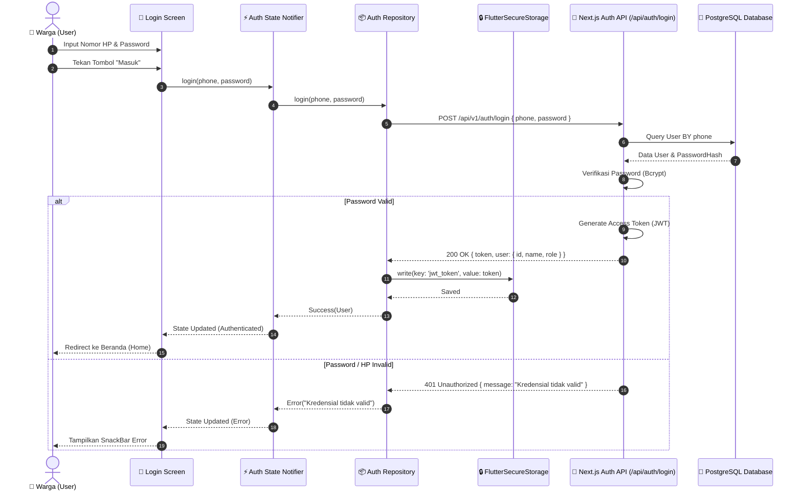
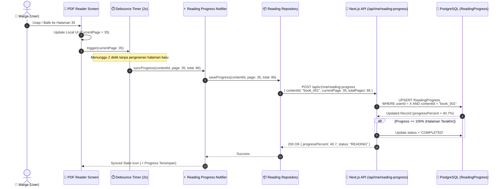
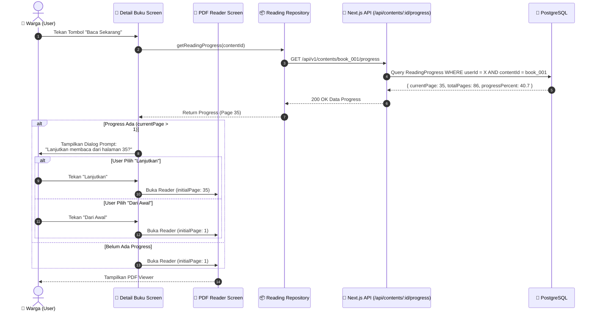
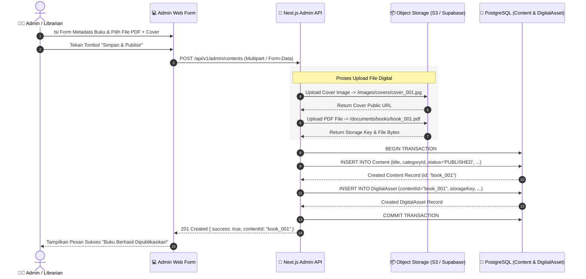

# Sequence Diagrams - Perpustakaan Digital Desa

Dokumen ini berisi **Sequence Diagrams** menggunakan Mermaid untuk 4 alur kerja utama aplikasi **Perpustakaan Digital Desa**.

---

## 1. Sequence Diagram: Authentication & Token Storage Flow

Menjelaskan proses login warga dari aplikasi Flutter hingga token disimpan secara aman di `FlutterSecureStorage`.

---

## 2. Sequence Diagram: Reading Progress Auto-Sync (PDF Reader)

Menjelaskan alur saat user membaca PDF, memindahkan halaman, dan progress disimpan ke backend secara otomatis (debounced).

---

## 3. Sequence Diagram: Resume Reading Flow (Lanjutkan Membaca)

Menjelaskan alur ketika user kembali membuka buku yang pernah dibaca dan ditawari melanjutkan dari halaman terakhir.

---

## 4. Sequence Diagram: Admin Upload Asset & Publish Content Flow

Menjelaskan alur kerja pengelola perpustakaan dalam mengunggah buku baru ke sistem.

