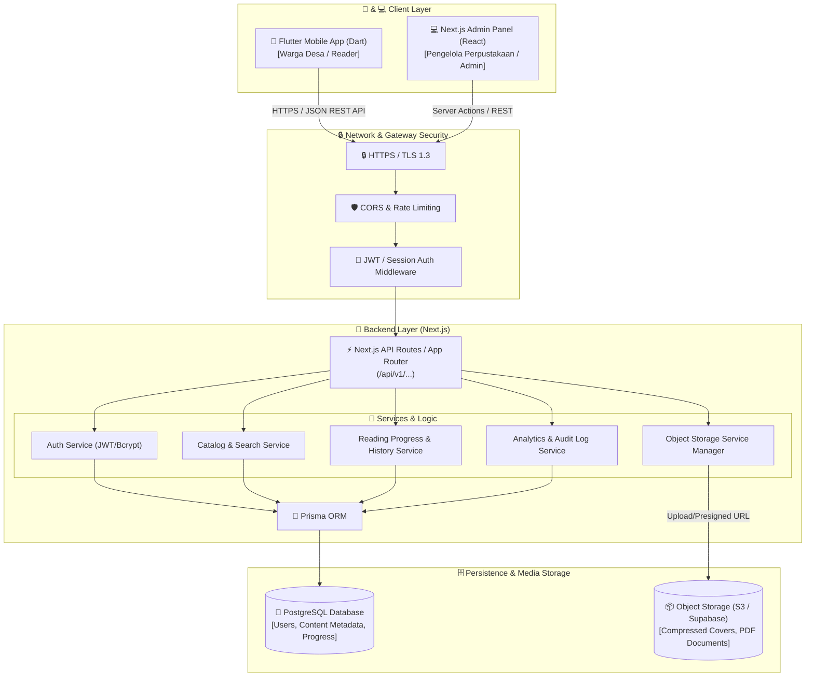
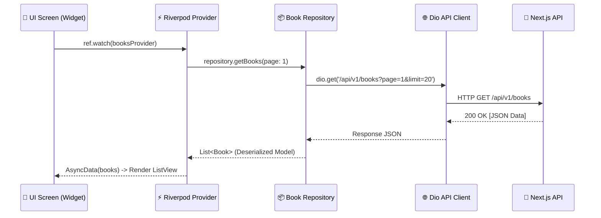

# System Architecture & Technical Specifications

Dokumen ini menjelaskan **Arsitektur Sistem**, **Struktur Projek Flutter**, **Role-Based Access Control (RBAC)**, dan **Strategi Efisiensi Bandwidth** untuk **Perpustakaan Digital Desa**.

---

## 1. System Architecture Diagram

Sistem menggunakan pola **Single Backend, Multi-Client**. Mobile Client (Flutter) dan Admin Panel (Next.js) terhubung ke Backend Service (Next.js REST API) yang sama. **Flutter tidak pernah terhubung langsung ke PostgreSQL atau Object Storage**.



---

## 2. Flutter Feature-Based Layered Architecture

Aplikasi Flutter dibangun dengan arsitektur **Feature-First + Riverpod + Dio + GoRouter**.

```text
lib/
│
├── main.dart                      # App entrypoint & ProviderScope initialization
│
├── app/
│   ├── app.dart                   # MaterialApp config, Theme & Localization setup
│   ├── router.dart                # GoRouter route definitions & Auth Guards
│   └── theme.dart                 # Material 3 Design System, Light/Dark/Sepia themes
│
├── core/
│   ├── constants/                 # App Constants (API URLs, Asset Paths, Storage Keys)
│   ├── network/                   # Dio Client setup, Interceptors, Error Handling
│   ├── storage/                   # FlutterSecureStorage & Local Cache handlers
│   ├── errors/                    # Custom Exception & Failure classes
│   └── utils/                     # Formatters, Debouncer, Bandwidth Helper
│
├── features/                      # Modular Feature Folders
│   ├── auth/                      # Authentication (Login, Register, Session)
│   │   ├── data/                  # Auth Repository & API Data Sources
│   │   ├── models/                # User & Token Models
│   │   ├── providers/             # Riverpod Auth State Notifier
│   │   └── presentation/          # Login & Register Screens
│   │
│   ├── home/                      # Home Screen, Greeting, Banners
│   ├── catalog/                   # Catalog, Categories & Search Features
│   ├── content_detail/            # Book Synopsis, Author, Action Buttons
│   ├── reader/                    # PDF Viewer, Page Controls, Reading Progress Auto-Sync
│   ├── bookshelf/                 # Currently Reading, Bookmark & History Tabs
│   └── profile/                   # User Profile, Reading Statistics & Settings
│
└── shared/                        # Shared UI Components
    ├── widgets/                   # Custom Cards, Chips, Skeleton Loaders
    └── buttons/                   # Primary, Secondary & Bookmark Buttons
```

### Data Flow dalam Fitur (UI -> Riverpod -> Repository -> Dio -> Server)



---

## 3. Role-Based Access Control (RBAC) Matrix

| Akses / Fitur | Guest | User (Warga) | Librarian | Admin | Super Admin |
| :--- | :---: | :---: | :---: | :---: | :---: |
| Lihat Katalog Public | ✅ | ✅ | ✅ | ✅ | ✅ |
| Cari & Filter Buku | ✅ | ✅ | ✅ | ✅ | ✅ |
| Baca Konten `PUBLIC` | ✅ | ✅ | ✅ | ✅ | ✅ |
| Baca Konten `REGISTERED` | ❌ | ✅ | ✅ | ✅ | ✅ |
| Simpan Progress Membaca | ❌ | ✅ | ✅ | ✅ | ✅ |
| Tambah Bookmark & Catatan | ❌ | ✅ | ✅ | ✅ | ✅ |
| Akses Rak Saya (Bookshelf) | ❌ | ✅ | ✅ | ✅ | ✅ |
| Upload & Olah Metadata Buku | ❌ | ❌ | ✅ | ✅ | ✅ |
| Publish / Unpublish Konten | ❌ | ❌ | ✅ | ✅ | ✅ |
| Kelola Kategori & Tag | ❌ | ❌ | ✅ | ✅ | ✅ |
| Kelola Akun Warga | ❌ | ❌ | ❌ | ✅ | ✅ |
| Kelola Admin / Librarian | ❌ | ❌ | ❌ | ❌ | ✅ |
| Lihat System Audit Log | ❌ | ❌ | ❌ | ✅ | ✅ |

---

## 4. Bandwidth-Aware & Caching Strategy (Khusus Daerah Pedesaan)

Mengingat kondisi jaringan di pedesaan bervariasi, aplikasi Flutter menerapkan **3 prinsip hemat kuota & performa tinggi**:

### 4.1 Thumbnail Optimization
- **Cover List & Grid**: Menggunakan gambar terkompresi beresolusi **300 x 450 px** (~20-40 KB per cover).
- **Cover Detail**: Resolusi tinggi baru diunduh saat pengguna membuka layar detail buku.
- **CachedNetworkImage**: Menggunakan memory & disk cache lokal sehingga cover yang pernah diunduh tidak di-download ulang.

### 4.2 Lazy Loading & Server Pagination
- API tidak pernah mengembalikan seluruh koleksi sekaligus (`SELECT * FROM Content`).
- Request menggunakan batas halaman: `GET /api/v1/contents?page=1&limit=20`.
- Infinite Scroll pada Flutter memicu halaman berikutnya (`page=2`) hanya saat pengguna men-scroll mendekati bagian bawah layar.

### 4.3 Strategy Caching: Network-First with Local Cache Fallback
- Ketika terhubung internet, aplikasi memuat data terbaru dari Next.js API dan memperbarui cache lokal (SQLite / Preferences).
- Ketika jaringan terputus (Offline), aplikasi secara otomatis menampilkan metadata buku, posisi halaman membaca terakhir, dan bookmark yang ada di cache lokal.
