# Use Case Diagram & Specifications - Perpustakaan Digital Desa

Dokumen ini berisi pemetaan **Use Case Diagram** dan **Spesifikasi Use Case** untuk aplikasi **Perpustakaan Digital Desa**.

---

## 1. Use Case Diagram

```mermaid
flowchart TB
    subgraph Actors["Aktor Sistem"]
        Guest["👤 Visitor / Guest"]
        User["📱 Warga Desa (Registered User)"]
        Admin["👨‍💼 Pengelola / Admin Perpustakaan"]
    end

    subgraph MobileApp["📱 Mobile Application (Flutter)"]
        UC01["UC-01: Registrasi & Login"]
        UC02["UC-02: Jelajah Katalog & Kategori"]
        UC03["UC-03: Pencarian Buku & Pengetahuan"]
        UC04["UC-04: Lihat Detail Konten"]
        UC05["UC-05: Membaca Konten (PDF Reader)"]
        UC06["UC-06: Simpan Progress Membaca (Auto Sync)"]
        UC07["UC-07: Lanjutkan Membaca (Resume)"]
        UC08["UC-08: Kelola Rak Saya (Bookshelf)"]
        UC09["UC-09: Tambahkan Bookmark & Catatan"]
        UC10["UC-10: Lihat Riwayat Bacaan (History)"]
        UC11["UC-11: Pengaturan Profil & Tema (Dark Mode)"]
    end

    subgraph AdminWeb["💻 Administrative Web (Next.js Admin)"]
        UC12["UC-12: Kelola Konten & Metadata"]
        UC13["UC-13: Upload Digital Asset (PDF & Cover)"]
        UC14["UC-14: Menerbitkan / Tarik Konten (Publish/Unpublish)"]
        UC15["UC-15: Kelola Kategori & Tag"]
        UC16["UC-16: Kelola Penulis & Lisensi HKI"]
        UC17["UC-17: Kelola Pengguna Desa"]
        UC18["UC-18: Lihat Analytics & Laporan Membaca"]
        UC19["UC-19: Kelola Repositori Pengetahuan Desa"]
        UC20["UC-20: Lihat Audit Log Sistem"]
    end

    %% Guest Access
    Guest --> UC02
    Guest --> UC03
    Guest --> UC04
    Guest --> UC01

    %% User Access
    User --> UC01
    User --> UC02
    User --> UC03
    User --> UC04
    User --> UC05
    User --> UC06
    User --> UC07
    User --> UC08
    User --> UC09
    User --> UC10
    User --> UC11

    %% Admin Access
    Admin --> UC01
    Admin --> UC12
    Admin --> UC13
    Admin --> UC14
    Admin --> UC15
    Admin --> UC16
    Admin --> UC17
    Admin --> UC18
    Admin --> UC19
    Admin --> UC20

    %% Includes & Extends Relationships
    UC05 -. "includes" .-> UC06
    UC05 -. "extends" .-> UC09
    UC07 -. "includes" .-> UC05
    UC12 -. "includes" .-> UC13
    UC12 -. "includes" .-> UC14
```

---

## 2. Matrix Aktor & Hak Akses Use Case

| ID | Nama Use Case | Guest | Warga (User) | Admin / Librarian | Interface |
| :--- | :--- | :---: | :---: | :---: | :---: |
| **UC-01** | Registrasi & Login | ✅ | ✅ | ✅ | Mobile & Web Admin |
| **UC-02** | Jelajah Katalog & Kategori | ✅ | ✅ | ✅ | Mobile App |
| **UC-03** | Pencarian Buku & Pengetahuan | ✅ | ✅ | ✅ | Mobile App |
| **UC-04** | Lihat Detail Konten | ✅ | ✅ | ✅ | Mobile App |
| **UC-05** | Membaca Konten (PDF Reader) | ⚠️ (Public Only) | ✅ | ✅ | Mobile App |
| **UC-06** | Simpan Progress Membaca Auto Sync | ❌ | ✅ | ✅ | Mobile App / API |
| **UC-07** | Lanjutkan Membaca (Resume) | ❌ | ✅ | ✅ | Mobile App |
| **UC-08** | Kelola Rak Saya (Bookshelf) | ❌ | ✅ | ✅ | Mobile App |
| **UC-09** | Tambahkan Bookmark & Catatan | ❌ | ✅ | ✅ | Mobile App |
| **UC-10** | Lihat Riwayat Bacaan | ❌ | ✅ | ✅ | Mobile App |
| **UC-11** | Pengaturan Profil & Tema | ❌ | ✅ | ✅ | Mobile App |
| **UC-12** | Kelola Konten & Metadata | ❌ | ❌ | ✅ | Admin Web |
| **UC-13** | Upload Digital Asset (PDF/Cover) | ❌ | ❌ | ✅ | Admin Web |
| **UC-14** | Publish / Unpublish Konten | ❌ | ❌ | ✅ | Admin Web |
| **UC-15** | Kelola Kategori & Tag | ❌ | ❌ | ✅ | Admin Web |
| **UC-16** | Kelola Penulis & Lisensi HKI | ❌ | ❌ | ✅ | Admin Web |
| **UC-17** | Kelola Pengguna | ❌ | ❌ | ✅ | Admin Web |
| **UC-18** | Lihat Analytics & Laporan | ❌ | ❌ | ✅ | Admin Web |
| **UC-19** | Kelola Repositori Pengetahuan Desa | ❌ | ❌ | ✅ | Admin Web |
| **UC-20** | Lihat Audit Log | ❌ | ❌ | ✅ | Admin Web |

---

## 3. Spesifikasi Detail Use Case Utama

### UC-05: Membaca Konten & Sync Progress (PDF Reader)

- **Aktor Utama**: Warga Desa (User)
- **Deskripsi**: User membaca buku/dokumen PDF melalui reader mobile, dan sistem mencatat halaman terakhir & persentase membaca secara otomatis.
- **Pre-conditions**:
  1. User telah login ke aplikasi mobile.
  2. Konten berstatus `PUBLISHED` dan user memiliki izin akses (`PUBLIC` atau `REGISTERED`).
- **Main Success Scenario (Flow Utama)**:
  1. User memilih tombol **"Baca Sekarang"** pada halaman Detail Konten.
  2. Aplikasi Flutter mengunduh/membuka file PDF menggunakan viewer PDF native.
  3. Aplikasi mengambil data progress terakhir dari server/cache lokal.
  4. Jika ada progress sebelumnya, aplikasi menampilkan prompt: *"Lanjutkan dari halaman X?"*.
  5. User berpindah halaman PDF.
  6. Ketika halaman berubah (atau setelah pergeseran halaman berhenti/debounce 2 detik), aplikasi mengirimkan payload ke API `POST /api/me/reading-progress`:
     - `contentId`, `currentPage`, `totalPages`, `progressPercentage`.
  7. Server menyimpan progress membaca ke database PostgreSQL.
  8. Jika halaman berada di lembar terakhir ( progress = 100% ), status bacaan diperbarui menjadi `COMPLETED`.
- **Alternate / Exception Flows**:
  - **Koneksi Terputus (Offline)**: Progress disimpan di lokal SQLite/Preferences. Ketika koneksi pulih, Flutter melakukan background sync ke server.
  - **File PDF Rusak / Tidak Ditemukan**: Aplikasi menampilkan pesan error: *"Gagal memuat dokumen digital"*, lalu menyediakan opsi retry.

---

### UC-08: Kelola Rak Saya (Bookshelf)

- **Aktor Utama**: Warga Desa (User)
- **Deskripsi**: User mengelola buku-buku yang sedang dibaca, disimpan, atau yang telah selesai dibaca.
- **Pre-conditions**: User dalam keadaan terautentikasi (Logged in).
- **Main Success Scenario**:
  1. User membuka tab **"Rak Saya"** di bottom navigation.
  2. Aplikasi memuat 3 sub-tab:
     - **Sedang Dibaca**: Menampilkan buku dengan progress > 0% dan < 100%.
     - **Bookmark**: Menampilkan daftar konten/halaman yang ditandai bookmark.
     - **Selesai Dibaca**: Menampilkan koleksi yang progress-nya telah 100%.
  3. User memilih salah satu kartu buku untuk melanjutkan membaca atau menghapus dari rak.

---

### UC-12 & UC-13: Kelola Konten & Upload Digital Asset (Admin Web)

- **Aktor Utama**: Admin / Librarian Perpustakaan
- **Deskripsi**: Admin mengunggah dokumen PDF dan cover buku, mengisi metadata, dan mempublikasikan buku ke aplikasi warga.
- **Pre-conditions**: Admin telah login ke Next.js Admin Panel dengan role `ADMIN` / `LIBRARIAN`.
- **Main Success Scenario**:
  1. Admin masuk ke menu **Konten -> Tambah Konten Baru**.
  2. Admin mengisi form metadata: Judul, Penulis, Kategori, Tipe (Buku, Modul, Sejarah Desa), Tahun, Deskripsi, Lisensi.
  3. Admin mengunggah file **Cover Image** (JPG/PNG, auto compress thumbnail) dan **Digital Asset (PDF)**.
  4. Backend Next.js menyimpan file ke Object Storage dan mencatat metadata file ke tabel `DigitalAsset`.
  5. Admin memilih status publikasi (`DRAFT` atau `PUBLISHED`).
  6. Konten tersimpan dan langsung dapat ditemukan di aplikasi mobile jika status `PUBLISHED`.
